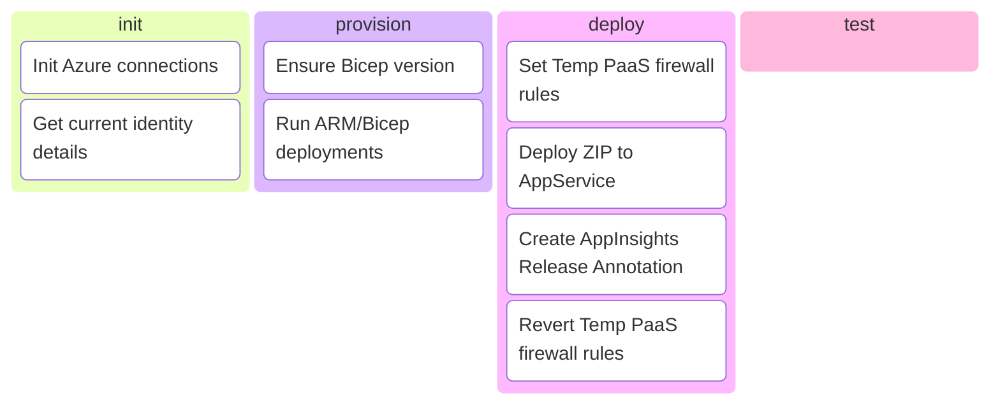

# ZeroFailed.Deploy.Azure

  
  
  
  

A [ZeroFailed](https://github.com/zerofailed/ZeroFailed) extension that provides deployment features targetted at the Azure cloud platform.

## Overview

| Component Type | Included | Notes                                                                                                                                                           |
| -------------- | -------- | --------------------------------------------------------------------------------------------------------------------------------------------------------------- |
| Tasks          | yes      |                                                                                                                                                                 |
| Functions      | yes      | [Function Reference](docs/functions.md)                                                                                                                         |
| Processes      | no       | Designed to be compatible with the default process provided by the [ZeroFailed.Deploy.Common](https://github.com/zerofailed/ZeroFailed.Deploy.Common) extension |

For more information about the different component types, please refer to the [ZeroFailed documentation](https://github.com/zerofailed/ZeroFailed/blob/main/README.md#extensions).

This extension consists of the following feature groups, refer to the [HELP page](./HELP.md) for more details.

- ARM deployments
- Application deployment
- Monitoring integrations
- Security

The diagram below shows the discrete features and when they run as part of the default build process provided by [ZeroFailed.Deploy.Common](https://github.com/zerofailed/ZeroFailed.Deploy.Common).

***NOTE:** The temporary PaaS firewall rules functionality makes use of the `OnExitAction` extensibility point provided by the [ZeroFailed.DevOps.Common](https://github.com/zerofailed/ZeroFailed.devops.common) extension to ensure that the rules are reverted before the process ends, even in the event of an error.*

## Pre-Requisites

Using this extension requires the following components to be installed:

- [Azure PowerShell modules](https://www.powershellgallery.com/packages/Az/)
- [Azure CLI](https://learn.microsoft.com/en-us/cli/azure/install-azure-cli?view=azure-cli-latest)

## Dependencies

| Extension                                                                          | Reference Type | Version |
| ---------------------------------------------------------------------------------- | -------------- | ------- |
| [ZeroFailed.Deploy.Common](https://github.com/zerofailed/ZeroFailed.Deploy.Common) | git            | `main`  |
| [ZeroFailed.DevOps.Common](https://github.com/zerofailed/ZeroFailed.DevOps.Common) | git            | `main`  |